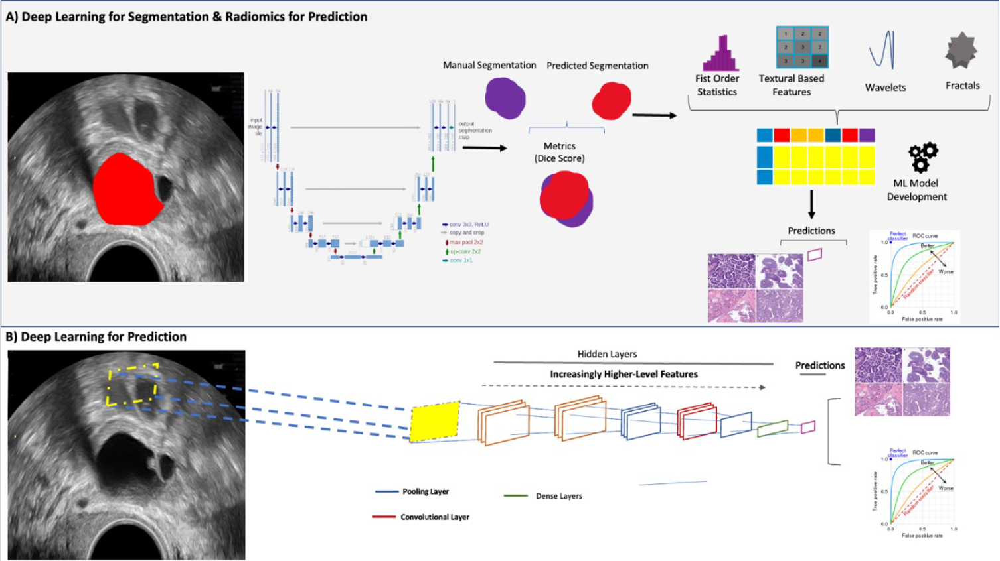

# adnexal-mass-classifier

[The Use of Machine Learning Models and Radiomics for Segmentation and Classification of Adnexal Masses on Ultrasound: A Multi-Cohort Retrospective Study](https://papers.ssrn.com/sol3/papers.cfm?abstract_id=4427456)

This repository contains the code and resources for the machine learning study focused on the segmentation and classification of adnexal masses using ultrasound imaging. Our study proposes an end-to-end machine learning approach aimed at automating the classification of adnexal masses, potentially improving diagnostic accuracy and aiding in the early detection of ovarian cancer.

## Abstract 
### Background
Ovarian cancer remains the deadliest of all gynaecological cancers. Ultrasound-based models exist to support the classification of adnexal masses but are dependent on human assessment of features on ultrasound. Therefore, we aimed to develop an end-to-end machine learning (ML) model capable of automating the classification of adnexal masses.
### Methods
In this retrospective study, transvaginal ultrasound scan images were extracted and segmented from Imperial College Healthcare, UK (ICH development dataset; n=577 masses; 1444 images)
and Morgagni-Pierantoni Hospital, Italy (MPH external dataset; n=184 masses; 476 images). Clinical data including age, CA-125 and diagnosis (ultrasound subjective assessment, SA) or
histology) were collected. A segmentation and classification model was developed by comparing several models using convolutional neural network-based models and traditional radiomics
features. Dice surface coefficient was used to measure segmentation performance and area under the ROC curve (AUC), F1-score and recall for classification performance.
### Findings
The ICH and MPH datasets had a median age of 45 (IQR 35-60) and 48 (IQR 38-57) and consisted of 23·1% and 31·5% malignant cases, respectively. The best segmentation model (MANet) achieved a dice surface coefficient of 0·85 ±0·01, 0·88 ±0·01 and 0·85 ±0·01 in the ICH training, ICH validation and MPH test sets. The best classification model achieved a recall of 1·00 and F1-score of 0·88 (AUC 0·93), 0·94 (AUC 0·89) and 0·83 (AUC 0·90) in the ICH training, ICH validation and MPH test sets, respectively.
### Interpretation
The proposed ML model provides a new pathway for adnexal mass analysis, which may enhance the diagnostic process. Further studies are necessary to evaluate the model's performance in a prospective setting.

## Overview of Approach  

*Figure: Overview of the machine learning classification approach for adnexal masses.*

## Features 
- Segmentation Model Code
- Classification Model Code
- Radiomics Model Code 


## Getting Started

To get started with this project, you'll need to set up a Python environment and install the necessary dependencies. We recommend using Conda for managing your environment. If you don't have Conda installed, you can download it from the [Anaconda](https://www.anaconda.com/products/individual) or [Miniconda](https://docs.conda.io/en/latest/miniconda.html) websites.

### Setting Up Your Conda Environment

**Create a new Conda environment** with Python 3.8:

```sh
conda create --name adnexal_classifier python=3.8
conda activate adnexal_classifier
pip install -r requirements.txt
```


## Updates
**Data Release:** The data utilized in this study is proprietary in-house data. Efforts are underway to release the ICH data publicly. We aim to provide open access to the data following the completion of the ongoing validation studies and necessary de-identification procedures to ensure patient privacy.

**Trained Model Release:** In addition to the data, we plan to release the trained models that were developed during this study. This will allow the community to replicate our results, further validate the models in different settings, and possibly improve upon the models with new data. The release schedule for these models is currently being determined, and we will provide updates as they become available. Please note that the trained models are subject to the same privacy and ethical considerations as the data itself. Stay tuned for further announcements regarding the availability of these trained models.

## License    
This project is licensed under the [MIT License](LICENSE) - see the `LICENSE` file for details.


